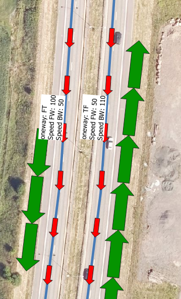

# How can you get Norwegian speed limit data?

How can you get Norwegian speed limit data from the Norwegian Road database (Nasjonal vegdatabank, shorthand NVDB)? This database is maintianed by a joint effort of the Norwegian Public Road administratin [NPRA](https://www.vegvesen.no/en/?lang=en)
and the [Norwegian Mapping Authority](https://kartverket.no/en)

Various distribution channels and products exists for NVDB data. Like any other data in NVDB, speed limits can be downloaded directly from the NVDB api. But the NPRA and the Norwegian Mapping authorities have a long history of delivering vendor-independent road network products (for, among other things,  routing applications). Speed limit data are of course included. 

The data are available through the [Norwegian Licence for Open Government Data](https://data.norge.no/nlod/en/). Please choose among the following options:

# Option 1. Grabbing data directly from the NVDB api 

The [NVDB api](https://nvdbapiles-v3.atlas.vegvesen.no/dokumentasjon/) is a REST api where you can grab any data from NVDB, including speed limits, road networks and a bunch of other things. Unfortunately, the documentation is in Norwegian. We've written some English summaries [here](https://www.vegdata.no/2014/02/19/a-little-note-to-oor-our-international-fans/) and [here](https://nvdbtransportportal.vegdata.no/), we hope you'll find them helpful. 

There are also some quirks involved in mapping from center line representation to individual lanes, eg roads where the traffic in oposite directions are physically separated, but we still store speed limit data on the abstract "center line"  somewhere mid between the physical lanes. [More details on these quirks when using data from the NVDB api](./grabbing-from-NVDBapi.md). If this doesn't bother you - fine, the NVDB api is by far the most modern and efficient method to keep your system up to date, including fetching only daily updates using the parameter `endret_etter=<ISO datetime string>`. 

[Our python code exampe](./grab-from-nvdbapi-w-python.md)

# Option 2: Downloading monthly updates of NPRA routing application data 

The NPRA runs its own routing application, and we update it with new network data about monthly (except for summer and Christmas holidays). Although the data structure is tailored to the specific quirks of that application, the network data we feed into it are in an open, not-too-obfuscated data structure. And these data are mapped to the correct topology level, so none of the quirks described for NVDB api data apply here.

### Speed limit directionality

Speed limits are stored as attributes `speedfw` (speed forward) and `speedbw` (speed backwards) on the links themselves, in the table `ruttger_link_geom`. _Forward_ and _backward_ refer to the direction of travel along the link, so you can have different speed limits for different directions on the same link. By `forward` we imply the direction defined by the geometry, i.e. you go forward by travelling from the starting point of the line to the last point of the line.  You may also have a peek on the attribute `oneway`, which describes the possible allowed direction of travels. Values are  `FT` _from-to_, i.ek forward, `TF`,  _to-from_, i.e. backward or `B` for both directions. 

 Here's a special case that seems weird at first glance, but actually isn't. At [this particular part of E18](https://vegkart.atlas.vegvesen.no/#kartlag:geodata/@237215,6585574,15/hva:!(id~105)~/hvor:(vegsystemreferanse~!EV18)~) we have 110 km/h travelling northwards, but 100 km/h travelling southwards. Direction of travel is indicated by the fat green arrows (rigthmost lane driving north, leftmost lane driving south), whereas blue lines with red arrows show the direction of the links in question.  

 

Here, the geometry of both links points southwards (red arrows), and we use the `oneway` attribute to indicate the allowed direction of travel (green arrows)
  * The northbound lane will have `oneway = TF` (To-From), i.e. it can only be traversed in the reverse direction. So the `speedfw` attribute should be ignored, and the attribute `speedbw = 110` is used. 
  * The southbound lane will have `oneway = FT` (From-To), i.e. it can only be traversed in the forward direction. So the `speedfw = 100` is the relevant value, and the `speedbw` should be ignored. 

For the inquisitive mind, we may reveal that the value 50 km/h is substituted by our production system as a default value wherever we may find gaps in the original NVDB data. There are no data gaps here, but the substition still happens. 

### Road classification

The road class attribute `roadclass` is a number ranging from 0 (Motorway) to 9 (little used residential or forest roads). We use this attribute in our own routing application, always striving to connect to and stay on the best quality (lowest number) for the majority of the route. The attribute `level`, ranging from 0 (important/best quality roads) to 3 (residential), is an older and now obsolete classification. 

The attribute `routeid` is the unique link sequence ID in our road data base. Together with our non-dimmensional linear reference system (attributes `from_measure` and `to_measure` we have a persistent identifier to the NVDB road network. _(We don't delete link sequences in NVDB, we just give them a termination date, so the reference is still valid even if this particular road may cease to exists)._ 

### Downloading routing application data

The newest NPRA routing application data can be downloaded from the FTP server ftp://vegvesen.hostedftp.com/~StatensVegvesen/vegnett/ , or alternatively from the [geonorge portal](./dowloading-from-geonorge-portal.md)

The spatiaLite (sqlite) format is recommended, this is the one we use ourselves. It is eaily read into tools like [QGIS]() and [FME (feature Manipulation Engine)](https://safe.com), both of these can be used to transform into shape files (and a bunch of other formats), in your favorite coordinate system. Lots of other tools can be used for spatialite. Surprisingly, the spatiaLite support in Python has detoriated: It's doable, but fiddly.

The file geodatabase format is a rough 1:1 format translation using the tool [FME](https://safe.com), provided as a courtesy for Esri users. 

# Option 3: Downloading monthly Elveg road network data set (will be replaced by Elveg 2.0)

This data product has in fact a longer history than our road data base. The format is the norwegian text based format [SOSI dot notation](https://en.wikipedia.org/wiki/SOSI), which has a long history for data exchange within the Norwegian GIS community. See [downloading from geonorge portal](./dowloading-from-geonorge-portal.md) for instructions on how to get this data set. 

# Option 4: Dowload Elveg 2.0 in GML format (experimental, will replace old Elveg)

Moving away from the old trusty sosi dot text format, the NPRA and the Norwegian Mapping Authority are developing a new vendor independent network data set called Elveg 2.0. There are several improvement to the logic and structure of the data, finally available in the [OGC](https://www.ogc.org/)-compliant format [GML - Geograpy Markup Language](https://en.wikipedia.org/wiki/Geography_Markup_Language). 

See [downloading from geonorge portal](./dowloading-from-geonorge-portal.md) for instructions on how to get this data set. 

# Why can't you just give us a shapefile? How hard can it be? 

Not hard at all, probably less than 30 minutes from start to finish (grab the latest route application network data, convert into a shapefile and share it). **But then the burden on keeping ***your*** system updated will be on NPRA**, from now on and untill eternernity.

Your system means it is your responsibility to feed it freshly updates. We at NPRA will happily provide extensive guidance on how you can make that happen - with special emphasis on the "you make it happen" - part. To that end, the NPRA and the Norwegian Mapping Authorities strives to continuosly improve NVDB-related services (NVDB api) and data products, which are available for free under the [NLOD license](https://data.norge.no/nlod/en/). 

We will do our outmost to ensure that the process of grabbing Norwegian speed limit data (all other road related data) can be automated in a robust pipeline. We are happy to discuss any suggestion on how to improve our services and data products. 

# There are ERRORS in the NPRA data 

We will be extremely gratefull if you care to communicate any errors, flaws or inconsistencies that you discover in our data sets. 