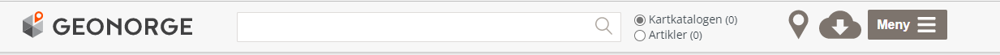
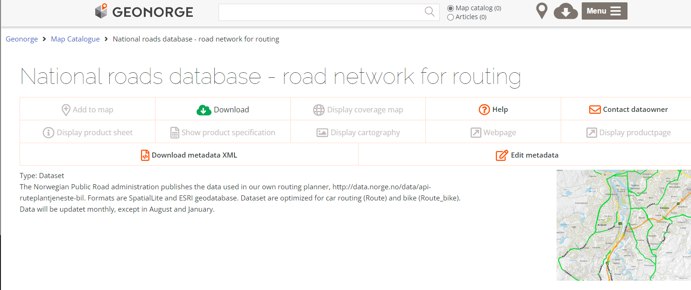
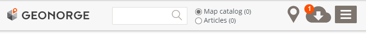
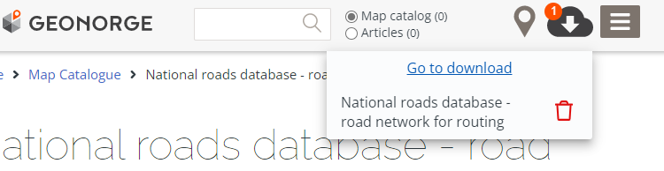
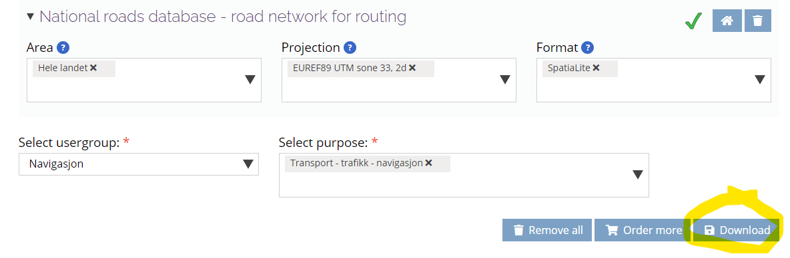
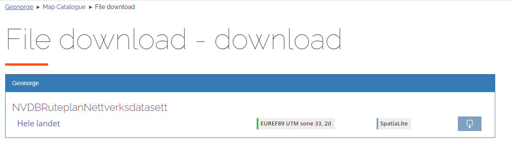

# The Geonorge data portal 

The [Norwegian Mapping Authority](https://kartverket.no/en) runs a sophisticated metadata catalogue and data distribution service
called [geonorge](https://www.geonorge.no/). To fascilitate automated downloads, Atom feeds exist for all dataset published through the geonorge portal.

Please chose the English language option, found on the iten _Meny_ (menu) on the upper right corner

# Speed limit data / routing application data 

All these NVDB road network products are updated approximtely monthly except January and August. Please look for fresh values in the Atom feed date tag "Updated" in the individual Atom feed entry. Usually, the Atom feed will contain one feed for the entire national data set (Norwegian _"Landsdekkende"_), but it may also have individual entries for each county (Norwegian _"Fylke"_). 

| Description | Format | Name and link to metadata | Atom feed |  
|-------------|--------|--------------------------------|-----------| 
| Network data for the NPRA routing application Note 26.8.2022: The Atom feed / geonorge issue has been resolved ~~Note 22.8.2022 The Geonorge Atom feed does not seem to pick up the latest publication of this data set~~ | spatiaLite | [NVDB Ruteplan nettverksdatasett](https://kartkatalog.geonorge.no/metadata/nvdb-ruteplan-nettverksdatasett/8d0f9066-34f9-4423-be12-8e8523089313)  | [Atom feed](https://nedlasting2.geonorge.no/geonorge/ATOM-feeds/NVDBRuteplanNettverksdatasett_AtomFeedSpatiaLite.xml) |
| Elveg network data set | [sosi text](https://en.wikipedia.org/wiki/SOSI) | [Elveg](https://kartkatalog.geonorge.no/metadata/elveg/ed1e6798-b3cf-48be-aee1-c0d3531da01a)  | [Atom feed](https://nedlasting2.geonorge.no/geonorge/ATOM-feeds/Elveg_AtomFeedSOSI.xml) | 
| Elveg 2.0 network data set, will replace Elveg | [Geograpy Markup Language](https://no.wikipedia.org/wiki/Geography_Markup_Language) | [Elveg 2.0](https://kartkatalog.geonorge.no/metadata/elveg-20/77944f7e-3d75-4f6d-ae04-c528cc72e8f6) | [Atom feed](https://nedlasting2.geonorge.no/geonorge/ATOM-feeds/Elveg2-0_AtomFeedGML.xml) | 

# Manuall download 

> The Geonorge manuall workflow is tailored for users that needs to download 10-50 different data sets, with a _"shopping chart"_ functionality and a final overview page with your selected downloads.

The big, green _"Download"_ button is easily located on the metadata page for the data set. 

However, this button doesn't start the download process. Rather, it's more **add to shopping chart** functionality. Your shopping chart symbol is found to the right of the top menu, and it should now have a red number symbolizing you have added one item.  

Click on the red number, and then click on _"Go to download"_. 

The downloads page requires that you fill in your geographical area of interest, preferred projection and file format and so on - all fields must be filled before proceeding with the "Download" click. We show here some sensible choices:

 

Which finally will take you to this page, where the "Down arrow-in-a-box" symbol actually will start transfering the file to your computer.  

